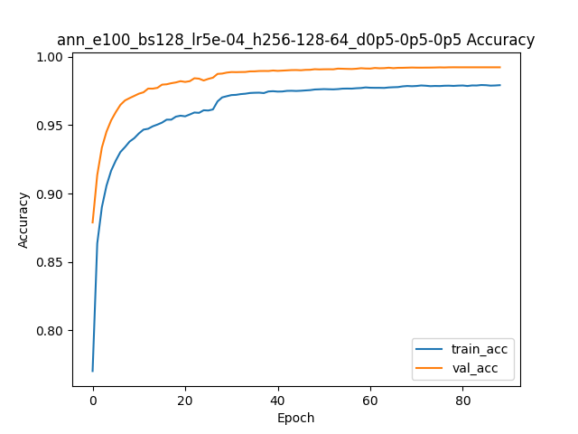
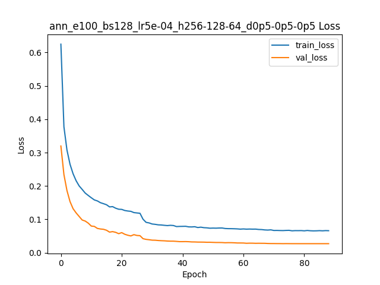
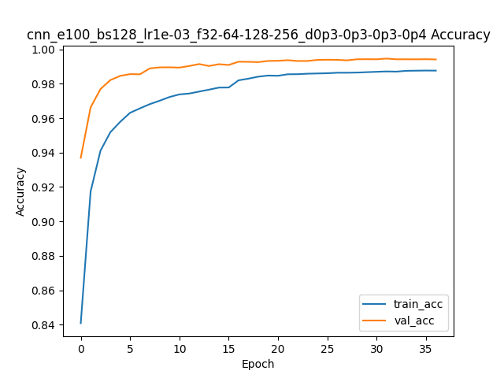
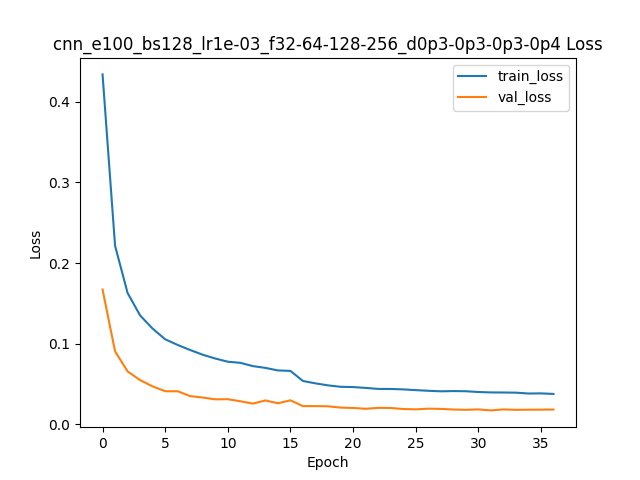
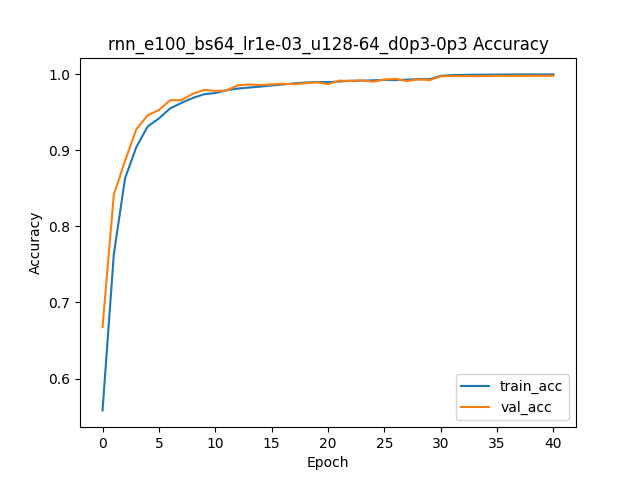
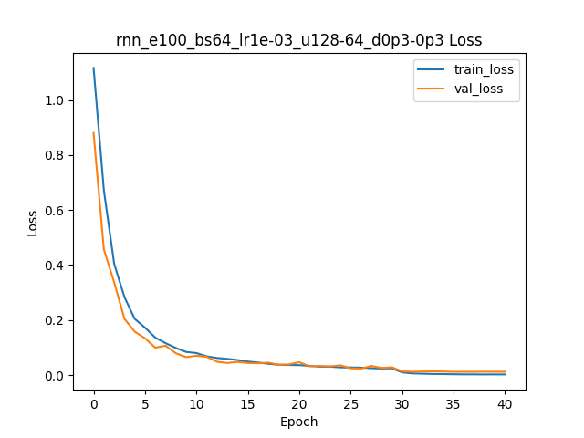
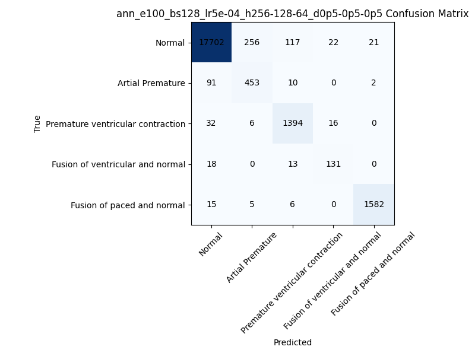
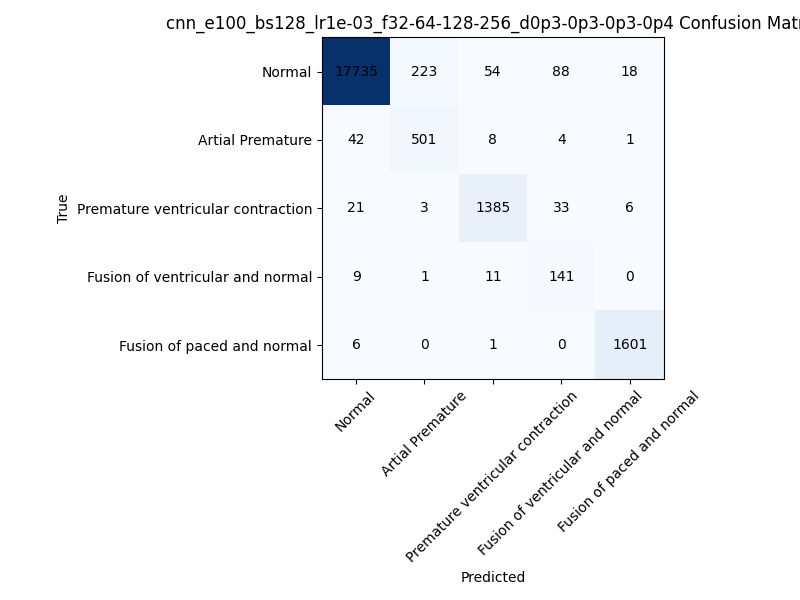
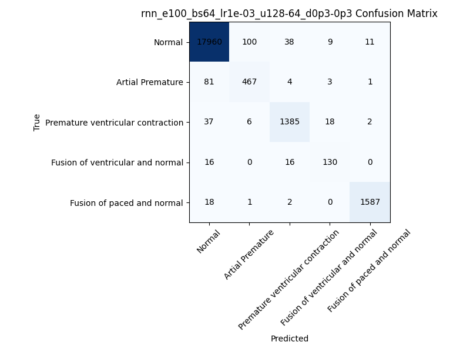

# EcgArrhythmiaDetection 🫀

## Resumen de conceptos 🧠

### Redes Neuronales Artificiales (RNA) 🔮  
Una Red Neuronal Artificial es un modelo computacional inspirado en la estructura y funciones de las neuronas biológicas, compuesto por capas de nodos (neuronas artificiales) que transfieren información mediante conexiones ponderadas. Cada neurona recibe señales de entrada, las combina linealmente, aplica una función de activación no lineal (por ejemplo ReLU) y transmite su salida a la siguiente capa. Las RNA feed-forward (o perceptrón multicapa) se emplean para clasificación y regresión cuando los datos no tienen componentes espaciales o temporales explícitos.

### Redes Neuronales Convolucionales (CNN) 👁️  
Las CNN son un tipo de RNA feed-forward optimizadas para datos con estructura espacial (imágenes o señales), usando **filtros convolucionales** que aprenden patrones locales mediante operaciones de convolución. Cada capa convolucional extrae mapas de características, seguidos por capas de **pooling** que reducen la dimensionalidad y **Batch Normalization** para estabilizar el entrenamiento. Dropout se añade para mitigar el sobreajuste, y finalmente una capa densa con softmax genera la distribución de probabilidad sobre las clases.

### Redes Neuronales Recurrentes (RNN) ⏱️  
Las RNN están diseñadas para datos secuenciales o series de tiempo, alimentando la salida de una neurona como entrada en pasos posteriores, lo que permite modelar dependencias temporales. Las variantes LSTM y GRU incorporan **mecanismos de puerta** para conservar información relevante por más pasos y evitar problemas de gradientes desaparecidos o explosivos.

## Enunciado del problema ❗

Las **enfermedades cardiovasculares (CVD)** son la principal causa de muerte global, con 17.9 millones de fallecimientos en 2019 (32 % de todas las muertes) según la OMS, y gran parte de ellas prevenibles si se detectan a tiempo. El objetivo es desarrollar modelos automáticos que clasifiquen señales de ECG de la base MIT-BIH Arrhythmia Database (48 grabaciones de 30 min, dos canales) para identificar distintos tipos de arritmias, mejorando la detección temprana y facilitando aplicaciones de telemedicina.

## Código 💻

<details>
<summary>1. Preprocesamiento de datos 🔍</summary>

Carga, normalización, balanceo y preparación de datos para los modelos.

```python
# data_processing.py

def load_data():
    train_df = pd.read_csv(TRAIN_FILE, header=None)
    test_df  = pd.read_csv(TEST_FILE,  header=None)
    return train_df, test_df

def preprocess(df):
    X = df.iloc[:, :187].astype(np.float32)      # 187 muestras temporales
    y = df.iloc[:, 187].astype(int)               # etiqueta (0–4)
    scaler = StandardScaler()
    X_scaled = scaler.fit_transform(X)            # normalización Z-score
    return X_scaled, y, scaler

# reshape para modelos 1D: (samples, timesteps, 1)
X_train = X_train.reshape(-1, 187, 1)
```
</details>

<details>
<summary>2. Definición de arquitecturas 🏗️</summary>

### RNA (Artificial Neural Network)
Capas densas y Dropout para extraer características globales.

```python
# models/ann.py

def build_ann(input_shape, hidden_sizes, dropout_rates):
    model = Sequential([Flatten(input_shape=input_shape)])
    for nh, dr in zip(hidden_sizes, dropout_rates):
        model.add(Dense(nh, activation='relu'))
        model.add(Dropout(dr))
    model.add(Dense(num_clases, activation='softmax'))
    model.compile(optimizer=Adam(lr), loss='categorical_crossentropy', metrics=['accuracy'])
    return model
```

### CNN (Convolutional Neural Network) 
Bloques Conv1D + BatchNorm + MaxPooling + Dropout.

```python
# models/cnn.py

def build_cnn(input_shape, filters, dropout_rates):
    model = Sequential()
    for i, (f, dr) in enumerate(zip(filters, dropout_rates)):
        if i == 0:
            model.add(Conv1D(f, kernel_size=5, activation='relu', input_shape=input_shape))
        else:
            model.add(Conv1D(f, 5, activation='relu'))
        model.add(BatchNormalization())
        model.add(MaxPooling1D(2))
        model.add(Dropout(dr))
    model.add(Flatten())
    model.add(Dense(64, activation='relu'))
    model.add(Dropout(0.5))
    model.add(Dense(num_clases, activation='softmax'))
    model.compile(optimizer=Adam(lr), loss='categorical_crossentropy', metrics=['accuracy'])
    return model
```

### RNN (LSTM)
Capas LSTM con `return_sequences` y Dropout.

```python
# models/rnn.py

def build_rnn(input_shape, units, dropout_rates):
    model = Sequential()
    for i, (u, dr) in enumerate(zip(units, dropout_rates)):
        rs = (i < len(units)-1)
        if i == 0:
            model.add(LSTM(u, return_sequences=rs, input_shape=input_shape))
        else:
            model.add(LSTM(u, return_sequences=rs))
        model.add(Dropout(dr))
    model.add(Dense(num_clases, activation='softmax'))
    model.compile(optimizer=Adam(lr), loss='categorical_crossentropy', metrics=['accuracy'])
    return model
```
</details>

<details>
<summary>3. Entrenamiento y guardado 🎯</summary>

Generación de nombre único para cada experimento, entrenamiento con EarlyStopping y guardado del mejor modelo.

```python
# train.py

# Generar nombre corto según parámetros
def make_run_name(args):
    lr_str = f"{args.learning_rate:.0e}"
    parts = [args.model, f"e{args.epochs}", f"bs{args.batch_size}", f"lr{lr_str}"]
    # anexar hidden_sizes/filters/units y dropout
    ...
    return "_".join(parts)

# Callbacks: EarlyStopping, ReduceLROnPlateau, ModelCheckpoint
callbacks = [
    EarlyStopping(patience=5, restore_best_weights=True),
    ReduceLROnPlateau(patience=3),
    ModelCheckpoint("temp_best.h5", save_best_only=True)
]

history = model.fit(X_train, y_train,
                    validation_data=(X_val, y_val),
                    epochs=args.epochs,
                    batch_size=args.batch_size,
                    callbacks=callbacks)

# Renombra y mueve al directorio de modelos
run_name = make_run_name(args)
os.replace("temp_best.h5", f"models/saved/{run_name}.h5")
```
</details>

<details>
<summary>4. Evaluación y métricas 📊</summary>

Cálculo y exportación de métricas de evaluación: pérdida y precisión en test, reporte de clasificación y matriz de confusión.

```python
# evaluate.py

# 1) Métricas globales
loss, acc = model.evaluate(X_test, y_test, verbose=0)
pd.DataFrame([{'test_loss': loss, 'test_accuracy': acc}]).to_csv(f"{run}/test_metrics.csv", index=False)

# 2) Reporte detallado
cr = classification_report(y_true, y_pred, target_names=LABELS, output_dict=True)
pd.DataFrame(cr).transpose().to_csv(f"{run}/classification_report.csv")

# 3) Matriz de confusión
evaluate_model(model, X_test, y_test, run_name, plots_dir=f"{run}/plots")
```
</details>

## Resultados 📈

**Curvas de entrenamiento y pérdida** 📉  
ANN:  
  


CNN:  
  
  

RNN:  
  
  

**Matriz de confusión** 🎯  
ANN:  
  
CNN:  
  
RNN:  
  

**Tabla de hiperparámetros y métricas** 📋  

| Modelo | Epochs | Batch Size | Learning Rate | Estructura (capas/filtros/unidades) | Dropout Rates | Val Accuracy | Val Loss | Test Accuracy | Test Loss |
|--------|--------|------------|---------------|-------------------------------------|---------------|--------------|----------|---------------|-----------|
| ANN    | 100    | 128        | 5e-4          | 256,128,64                          | 0.5,0.5,0.5   | 0.992        | 0.027    | 0.971         | 0.113     |
| CNN    | 100    | 128        | 1e-3          | 32,64,128,256                       | 0.3,0.3,0.3,0.4| 0.994        | 0.018    | 0.976         | 0.095     |
| RNN    | 100    | 64         | 1e-3          | 128,64                              | 0.3,0.3       | 0.998        | 0.012    | 0.983         | 0.115     |

**Reporte de clasificación ANN**  

| Clase                          | Precision | Recall | F1-Score | Soporte |
|--------------------------------|-----------|--------|----------|---------|
| Normal                        | 0.991     | 0.977  | 0.984    | 18118   |
| Artial Premature              | 0.629     | 0.815  | 0.710    | 556     |
| Premature ventricular contraction | 0.905 | 0.963  | 0.933    | 1448    |
| Fusion of ventricular and normal | 0.775   | 0.809  | 0.792    | 162     |
| Fusion of paced and normal    | 0.986     | 0.984  | 0.985    | 1608    |
| **Macro avg**                 | 0.857     | 0.909  | 0.881    | 21892   |
| **Weighted avg**              | 0.974     | 0.971  | 0.972    | 21892   |

**Reporte de clasificación CNN**  

| Clase                          | Precision | Recall | F1-Score | Soporte |
|--------------------------------|-----------|--------|----------|---------|
| Normal                        | 0.996     | 0.979  | 0.987    | 18118   |
| Artial Premature              | 0.688     | 0.901  | 0.780    | 556     |
| Premature ventricular contraction | 0.949 | 0.956  | 0.953    | 1448    |
| Fusion of ventricular and normal | 0.530   | 0.870  | 0.659    | 162     |
| Fusion of paced and normal    | 0.985     | 0.996  | 0.990    | 1608    |
| **Macro avg**                 | 0.830     | 0.940  | 0.874    | 21892   |
| **Weighted avg**              | 0.980     | 0.976  | 0.977    | 21892   |

**Reporte de clasificación RNN**  

| Clase                          | Precision | Recall | F1-Score | Soporte |
|--------------------------------|-----------|--------|----------|---------|
| Normal                        | 0.992     | 0.991  | 0.991    | 18118   |
| Artial Premature              | 0.814     | 0.840  | 0.827    | 556     |
| Premature ventricular contraction | 0.958 | 0.956  | 0.957    | 1448    |
| Fusion of ventricular and normal | 0.813   | 0.802  | 0.807    | 162     |
| Fusion of paced and normal    | 0.991     | 0.987  | 0.989    | 1608    |
| **Macro avg**                 | 0.913     | 0.915  | 0.914    | 21892   |
| **Weighted avg**              | 0.984     | 0.983  | 0.983    | 21892   |

## Comparación de los tres clasificadores 🔍

A continuación se presenta un análisis comparativo de los tres modelos implementados (ANN, CNN y RNN) utilizando las métricas de validación y test accuracy, recall y F1-score. Los resultados se basan en los experimentos realizados sobre el dataset MIT-BIH Arrhythmia:

| Modelo | Val Accuracy | Test Accuracy | Macro Recall | Macro F1-score |
|--------|--------------|---------------|--------------|----------------|
| ANN    | 0.992        | 0.971         | 0.909        | 0.881          |
| CNN    | 0.994        | 0.976         | 0.940        | 0.874          |
| RNN    | 0.998        | 0.983         | 0.915        | 0.914          |

- **CNN** obtuvo el mejor desempeño general en validación, pero RNN logró la mayor precisión en test.
- **RNN** (LSTM) mostró un excelente rendimiento en la modelización de dependencias temporales, con métricas muy competitivas.
- **ANN** logró resultados sólidos, aunque ligeramente inferiores, siendo más sensible a la selección de hiperparámetros y al preprocesamiento.

El análisis detallado de los reportes de clasificación muestra que tanto CNN como RNN presentan mayor recall y F1-score en las clases minoritarias respecto a ANN, lo que indica mejor capacidad de generalización ante el desbalance de clases.

## Conclusiones y observaciones 🎯

- **Desempeño relativo** 📈: RNN es el modelo más robusto para la tarea, seguido de cerca por CNN. ANN es más simple y rápido de entrenar, pero menos eficaz ante la complejidad de las señales ECG.
- **Limitaciones** ⚠️: Se observa cierto desbalance en la clasificación de clases poco representadas, lo que sugiere la necesidad de técnicas adicionales como data augmentation o ajuste de pesos de clase.
- **Propuestas de mejora** 🚀:
  - 🔄 Explorar arquitecturas híbridas (por ejemplo, CNN+RNN) para aprovechar tanto la extracción local de características como la modelización temporal.
  - ⚡ Ajustar la ventana temporal de entrada y experimentar con mecanismos de atención.
  - 🎯 Implementar estrategias de regularización y validación cruzada para mejorar la generalización.
  - 🔍 Investigar el impacto de diferentes técnicas de preprocesamiento y normalización.

Estos resultados demuestran el potencial de las redes neuronales profundas para la detección automática de arritmias en señales ECG, facilitando aplicaciones de telemedicina y diagnóstico asistido. 🏥

## Referencias 📚

1. Neural network (machine learning) – Wikipedia 
2. What Is a Neural Network? – Investopedia 
3. Convolutional neural network – Wikipedia  
4. Convolutional layer – Wikipedia 
5. Recurrent neural network – Wikipedia 
6. RNN (software) – Wikipedia 
7. MIT-BIH Arrhythmia Database – PhysioNet 
8. Cardiovascular diseases (CVDs) – WHO Fact Sheet 
9. What is Accuracy, Precision, Recall and F1 Score? – Labelf AI
10. Accuracy vs. precision vs. recall in machine learning – Evidently AI
